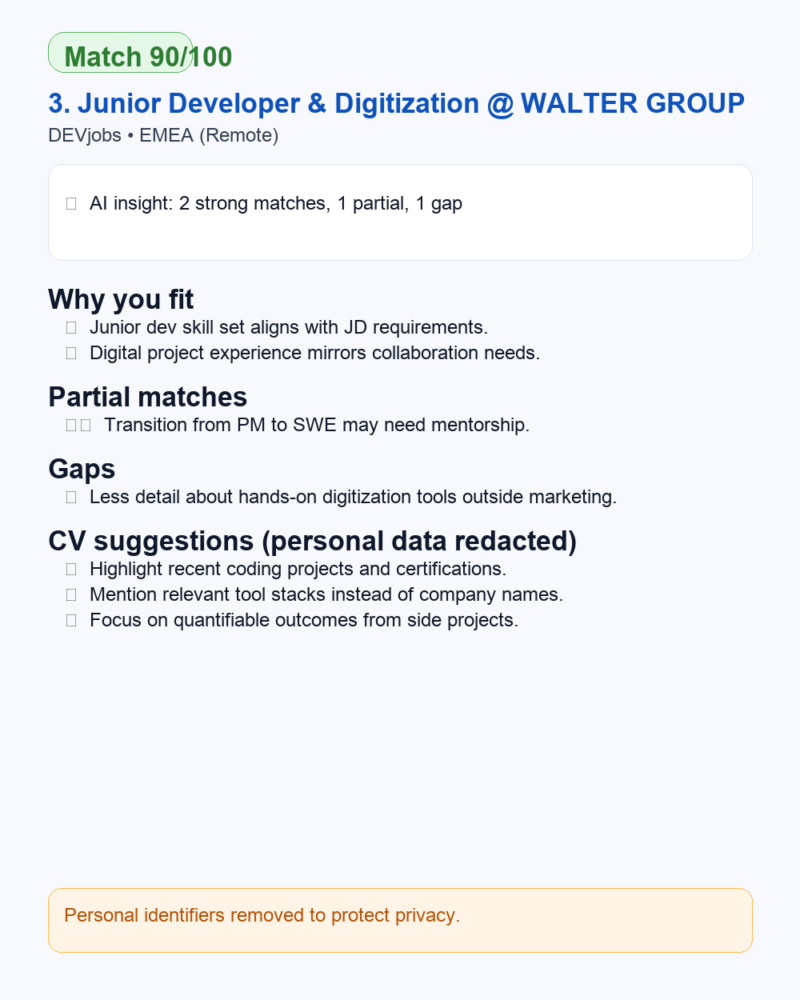

# AI Job Agent · Vibe Coding in Action

Why This Project Exists

I noticed that LinkedIn Job Alerts are often noisy: lots of irrelevant senior roles, vague matches, and no clear sense of how well a job fits my real experience. That’s where this project started — as a personal filter for job alerts.

This project started as a personal tool to **filter LinkedIn Job Alerts**, extract the **essence of each JD**, and show **how well each role matches my real experience**. The output is a short, high‑signal digest you actually want to read.

What This Project Demonstrates

A small but complete example of **vibe coding**:
- Start from a real, personal pain point.
- Build the smallest useful end‑to‑end loop.
- Let AI help with parsing, matching, UX, and iteration.
- Keep the system simple, hackable, and fun to extend.

---

## What This Agent Does

An automated job‑search assistant that:

- Reads **LinkedIn Job Alert** emails from Gmail via IMAP.
- Parses and normalizes job listings from the raw HTML.
- Uses LLMs to:
  - Extract **structured requirements** from each JD.
  - Match those requirements against your **CV**.
- Filters out low‑match and clearly irrelevant roles.
- Sends a **batched Gmail email or WhatsApp message** with the best matches.
- Logs statistics and results for later analysis and tuning.

The result: LinkedIn alerts become a **curated, AI‑filtered shortlist** instead of a noisy inbox stream.

---

## Key Features

- Auto-read Gmail LinkedIn Job Alert emails
- Parse job information (title, company, location, link)
- LLM-powered intelligent matching (0-100 score + reasoning)
- Match & gap analysis + CV suggestions (experimental)
- WhatsApp batch notifications (saves 66-80% Twilio costs)
- Automatic deduplication (history-based)
- LangGraph workflow orchestration
- Dry-run mode for testing without API costs


<sub>Example notification card (personal identifiers redacted)</sub>

---

## Quick Start

### 1. Requirements

- Python 3.10+
- Gmail account (with IMAP enabled and app-specific password)
- OpenAI API Key
- Twilio account (for WhatsApp API)

### 2. Installation

```bash
# Clone the repository
git clone https://github.com/YOUR_USERNAME/ai-job-agent.git
cd ai-job-agent

# Create virtual environment
python -m venv venv
source venv/bin/activate  # Windows: venv\Scripts\activate

# Install dependencies
pip install -r requirements.txt
```

### 3. Configuration

```bash
# Copy environment template
cp .env.example .env

# Edit .env with your credentials:
# - Gmail account info
# - OpenAI API Key
# - Twilio WhatsApp credentials
# - Match threshold

# Prepare CV file
cd data
cp cv_template.txt cv.txt
# Edit cv.txt with your actual resume (supports .txt and .pdf)

# Prepare history file
cp history_template.json history.json
```

### 4. Run

```bash
# Single run
python -m src.main

# Or set up cron job (runs every hour)
# See docs/DEPLOYMENT.md for details
```

---

## Notes & Caveats

- **LLM limitations**
  The match scores, gap analysis, and CV suggestions are best‑effort heuristics, not absolute truth. They’re meant to help you think, not replace your judgment.

- **Privacy**
  Your CV, job history, and logs live locally (or wherever you deploy this). Be mindful of where you run it and which APIs you use.

- **Extensibility**
  This project is intentionally small and opinionated, but the LangGraph architecture makes it straightforward to:
  - Add new job sources.
  - Try alternative models.
  - Change filtering rules.
  - Integrate with other notification channels.

If LinkedIn Job Alerts feel like “almost the right tool” but not quite, this agent turns them into something sharper, more personal, and more actionable — while showcasing what AI‑assisted **vibe coding** can look like on a real, everyday workflow.
